<!--
  ╔═══════════════════════════════════════════════════════════════════╗
  ║  GPOS — GitHub Profile Operating System v2.0                     ║
  ║  A self-hosted, animated, SVG-based operating system dashboard   ║
  ║  for your GitHub profile. No third-party services. No tokens.     ║
  ║  Generated by Python + GitHub Actions.                          ║
  ╚═══════════════════════════════════════════════════════════════════╝
-->

<div align="center">

<!-- ═══════ BOOT SEQUENCE ═══════ -->
<h3><code>iliya@cloud:~$ ./boot.sh</code></h3>


<br><br>

<!-- ═══════ MISSION BRIEFING ═══════ -->
<h3><code>iliya@cloud:~$ cat mission.md</code></h3>


<br><br>

<!-- ═══════ SYSTEM STATUS ═══════ -->
<h3><code>iliya@cloud:~$ htop</code></h3>


<br><br>

<!-- ═══════ PCB ACTIVITY CIRCUIT ═══════ -->
<h3><code>iliya@cloud:~$ ./activity-pcb.sh</code></h3>


<br><br>

<!-- ═══════ NETWORK ARCHITECTURE ═══════ -->
<h3><code>iliya@cloud:~$ netstat -a</code></h3>


<br><br>

<!-- ═══════ SYSTEM LOG ═══════ -->
<h3><code>iliya@cloud:~$ tail -f /var/log/deploy.log</code></h3>


<br><br>

<!-- ═══════ FOOTER ═══════ -->
<h3><code>iliya@cloud:~$ cat contact.md</code></h3>

<p>
  <samp>
    Building autonomous AI systems at the edge of the internet.<br>
    Fredy · Hermes · Pixoris · Hades Army · IVAI<br>
    <a href="https://your-site.com">Portfolio</a> ·
    <a href="https://your-site.com/blog">Blog</a> ·
    <a href="https://t.me/your_bot">Telegram</a>
  </samp>
</p>

</div>

---

<details>
<summary><code>iliya@cloud:~$ ls -la scripts/</code></summary>

| Script | Purpose |
|--------|---------|
| `make_boot_sequence.py` | OS boot animation with typing effect |
| `make_mission_card.py` | Mission briefing / personality card |
| `make_system_status.py` | CPU/RAM/Workers/Latency dashboard |
| `make_network_flow.py` | Branching architecture with packet flow |
| `make_system_log.py` | Deploy log with typing effect |
| `fetch_contributions.py` | Scrape public contribution data |
| `render_heatmap_svg.py` | PCB trace contribution heatmap |

</details>

<details>
<summary><code>iliya@cloud:~$ crontab -l</code></summary>

Daily at 06:17 UTC, GitHub Actions:
1. Fetches your public contribution calendar
2. Re-renders all SVGs with fresh data
3. Commits updates automatically

No token. No third-party service. 100% self-hosted.

</details>

<details>
<summary><code>iliya@cloud:~$ cat stack.txt</code></summary>

```
Frontend:     React · Next.js · Tailwind · TypeScript
Backend:      Node.js · Python · Cloudflare Workers
AI:           OpenRouter · Gemini · Claude · GPT · DeepSeek
Infra:        Cloudflare · Workers · D1 · R2 · KV
DevOps:       GitHub Actions · Docker · Wrangler
```

</details>
